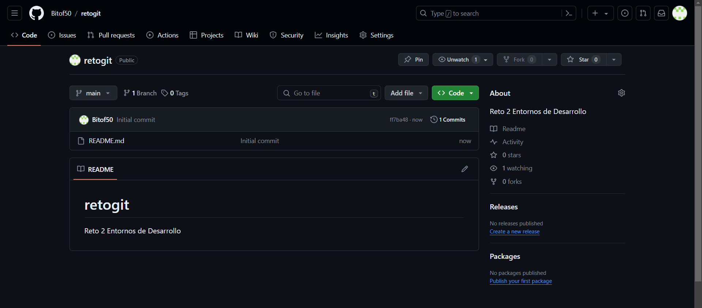
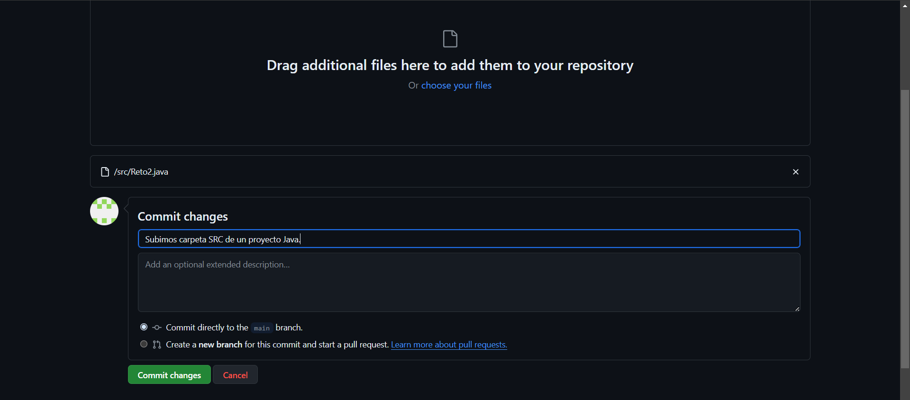
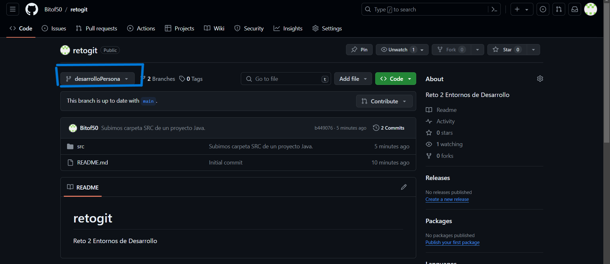
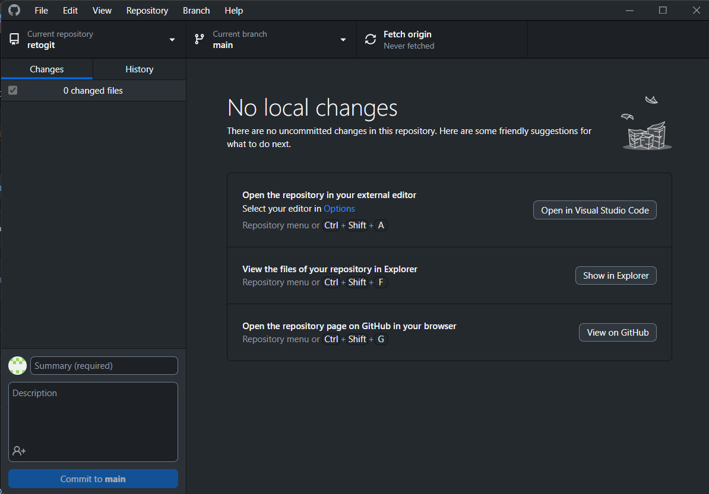
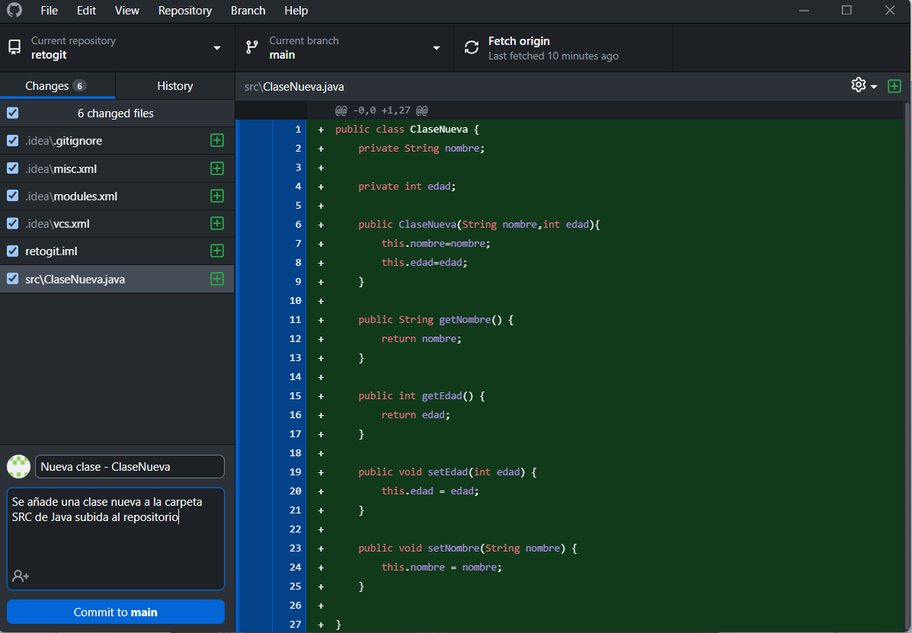
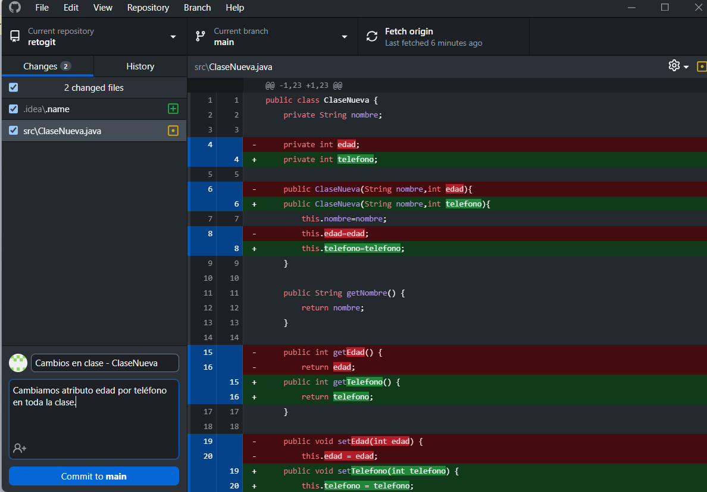
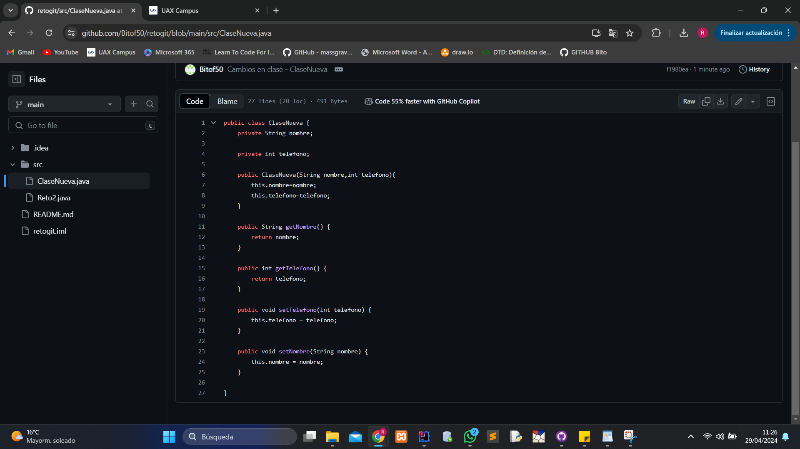

# PRIMEROS PASOS CON GITHUB

## CREAR UN REPOSITORIO
Crea un nuevo repositorio haciendo clic en el botón de "Nuevo repositorio" en la página web de GitHub.
Elije un nombre para tu primer repositorio, agrega una pequeña descripción, marca la opción "Inicializar este repositorio con un README", y haz clic en el botón "Crear Repositorio".

## SUBIDA DE ARCHIVOS AL REPOSITORIO
En la web del repositorio, encima de la lista de archivos, seleccione el menú de lista desplegable Cargar archivos y haga clic en Agregar archivos. Como alternativa, puede arrastrar y colocar archivos en el explorador. Cuando estén listos haremos un "Commit", que será para guardar todos los cambios.

## CREAR UNA NUEVA RAMA
Agregarás una nueva rama al repositorio para trabajar de varias maneras sin afectar al proyecto principal.
En la vista de árbol de archivos de la izquierda, selecciona el menú desplegable de ramas y, a continuación, haz clic en Ver todas las ramas. También puedes encontrar el menú desplegable de ramas en la parte superior del editor de archivos integrado.

## DESCARGAR CONTENIDO DE RAMA EN REPOSITORIO LOCAL
Necesitaras instalar la versión GitHub Desktop. Para ello se hará a través de la página de GitHub oficial.
Una vez descargado, haras un "Clone"(clonado) del repositorio en la aplicación. Para ello hay que pulsar en el menú de opciones, en la opción "File", y luego en "Clone repository".

## MODIFICACIÓN DE ARCHIVOS EN EL REPOSITORIO LOCAL Y COMO ACTUALIZAR EL REPOSITORIO WEB.
En menú de opciones de la aplicación, haz clic en el botón "Show in Explorer", se abrirá la ruta donde tienes todos los archivos, ahí decidirás si modificar algo,agregar algo o eliminar algo.
Cuando lo hagas, automaticamente el repositorio local te mostrará todos los cambios hechos, puedes poner un comentario con la información adecuada. Después de esto haremos un "Push" para agregar todos los cambios al repositorio web.
En la propia aplicación habrá un botón verde donde pulsarás para ello: "Push in origin"

En la siguiente imagen hemos agregado un archivo:

En la siguiente imagen hemos modificado el archivo:

## FUSIONAR RAMA SECUNDARIA CON MAIN
Cuando haces cambios en una rama secundaria y quieres añadir los cambios a la principal o viceversa, lo haremos a través de un "Pull request", el repositorio web detecta que hay cambios y te ofrece un "merge" que sería la fusión de las ramas, para ellos harás clic en el menú de las ramas, luego verás que la web te ofrece el pull request, cuanco clicas te sale un menú donde puedes añadir información con respecto al cambio. Haces clic en el botón "Commit changes" y acto seguido la propia web te hace la operación para ver si son compatibles para hacer una fusión, de este modo puedes hacerle un merge.

## DETALLES DEL PROCESO
Aquí está el repositorio con todos los cambios.

## AYUDA CON TÉRMINOS DE GITHUB

Las funciones más importantes de GD son:
⦁	Clone (Clonar):
⦁	Git: Clona un repositorio remoto en tu máquina local. Este comando crea una copia exacta del repositorio, incluyendo todas las ramas y el historial de commits.
⦁	GitHub: Puedes clonar un repositorio desde la interfaz web de GitHub o usando la URL del repositorio en tu terminal.
⦁	Pull (Tirar):
⦁	Git: Descarga los cambios desde un repositorio remoto y los incorpora en tu rama local.
⦁	GitHub: Puedes hacer un pull desde la interfaz web de GitHub o utilizando el comando git pull en tu terminal.
⦁	Push (Empujar):
⦁	Git: Sube tus cambios locales al repositorio remoto.
⦁	GitHub: Puedes hacer un push desde la interfaz web de GitHub o utilizando el comando git push en tu terminal.
⦁	Commit:
⦁	Git: Guarda los cambios realizados en los archivos de tu repositorio. Cada commit tiene un mensaje asociado que describe los cambios realizados.
⦁	GitHub: Puedes realizar commits desde la interfaz web de GitHub o utilizando el comando git commit en tu terminal.
⦁	Fetch (Recuperar):
⦁	Git: Descarga todos los cambios del repositorio remoto a tu repositorio local, pero no los incorpora automáticamente en tu rama actual.
⦁	GitHub: Se puede hacer un fetch desde la interfaz web de GitHub o utilizando el comando git fetch en tu terminal.
⦁	Merge (Fusionar):
⦁	Git: Combina los cambios de una rama en otra rama. Por ejemplo, puedes fusionar una rama de desarrollo en una rama principal como main o master.
⦁	GitHub: Se puede hacer un merge desde la interfaz web de GitHub o utilizando el comando git merge en tu terminal.
⦁	Branch (Rama):
⦁	Git: Permite trabajar en paralelo en diferentes líneas de desarrollo. Cada rama puede contener cambios independientes.
⦁	GitHub: Puedes crear, eliminar y administrar ramas desde la interfaz web de GitHub o utilizando el comando git branch en tu terminal.
⦁	Pull Request (Solicitud de extracción):
⦁	GitHub: Una solicitud de extracción es una forma de proponer cambios en un repositorio. Permite a otros revisar los cambios antes de fusionarlos en la rama principal. Se puede crear desde la interfaz web de GitHub.

